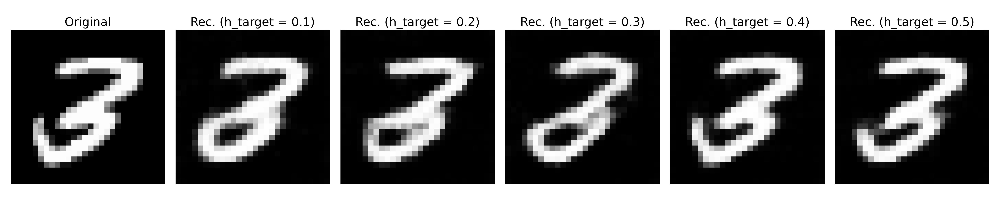
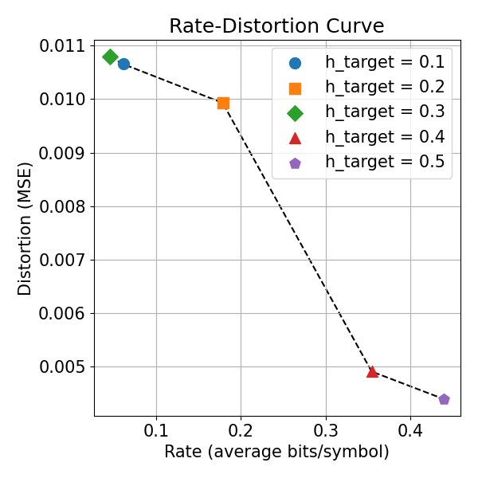

# Neural Compression of Images via Rate-Distortion Learning Using CAE & CNN

An end-to-end image compression system in PyTorch, demonstrated on the MNIST dataset. This project explores rate–distortion optimization using a convolutional autoencoder jointly trained with a probabilistic context model.

<p align="center">
  
</p>

## Project Overview

This repository implements a complete neural image compression pipeline. The key features of this implementation include:

* **Concurrent Training Framework**: The core of the training process where the autoencoder and a probabilistic context model are optimized simultaneously, forcing the autoencoder to learn a highly compressible latent representation.

* **3D Causal Context Model**: A 3D-CNN that uses masked convolutions to accurately estimate the entropy (bitrate) of the latent representation, which is essential for the concurrent training.

* **Convolutional Autoencoder**: An encoder and decoder network that employs a deep residual architecture with nested skip connections to effectively transform the images.

* **Differentiable Quantizer**: A quantizer that discretizes the continuous latent space using a soft-to-hard estimation technique, enabling end-to-end training.

* **Importance Map**: A mechanism that allows the model to learn to allocate more bits to complex regions of an image, further optimizing the compression.

By training multiple models with different target bitrates, a rate–distortion (R–D) curve can be obtained:

<p align="center">
  
</p>

## Repository Structure

```
├── figures
├── install
│   └── requirements.txt            # Python dependencies for the project
├── src
│   ├── modules
│   │   ├── autoencoder.py          # Defines the autoencoder architecture
│   │   ├── contextmodel.py         # Defines the 3D causal context model
│   │   ├── quantizer.py            # Defines the soft-to-hard quantizer
│   │   ├── saver.py                # Helper class for saving/loading checkpoints
│   │   └── utils.py                # Utility functions (e.g., logger setup)
│   ├── evaluate.py                 # Script to evaluate models and plot the R-D curve
│   ├── run_experiments.sh          # Bash script to automate training multiple models
│   └── train.py                    # Main script for training a single model instance
```

## Installation

1.  **Clone the Repository**
    ```bash
    git clone https://github.com/nicolasgiovanardi/emc5022.git
    cd emc5022
    ```

2.  **Create and Activate a Virtual Environment** (Recommended)
    ```bash
    python3 -m venv venv
    source venv/bin/activate
    ```

3.  **Install Dependencies**
    All required Python packages are listed in the `requirements.txt` file.
    ```bash
    pip install -r install/requirements.txt
    ```

## Usage

The project has three main workflows: training a single model, running a series of experiments to generate a rate-distortion curve, and evaluating the results.

#### 1. Training a Single Model

You can train one instance of the model using `src/train.py`. The MNIST dataset will be downloaded automatically to the specified data directory on the first run.

* **Basic Usage**:
    ```bash
    python3 src/train.py
    ```

* **Advanced Usage with Custom Parameters**:
    You can control some aspects of the model and training via command-line arguments. For example, to train a model that aims for a lower bitrate:
    ```bash
    python3 src/train.py \
        --beta 0.1 \
        --h_target 1.0 \
        --num_latent_channels 32 \
        --epochs 50
    ```
    All results, including checkpoints, logs, and sample reconstructed images, will be saved to a unique timestamped directory inside `logs/`.

#### 2. Generating a Rate-Distortion (R-D) Curve

The `src/run_experiments.sh` script automates the process of training several models with different hyperparameters to generate points for an R-D curve.

1.  **Make the script executable** (you only need to do this once):
    ```bash
    chmod +x src/run_experiments.sh
    ```

2.  **Run the experiments**:
    ```bash
    ./src/run_experiments.sh
    ```
    This will train multiple models sequentially. The results will be saved in separate subdirectories inside the `logs/` folder specified within the script.

#### 3. Evaluating and Plotting Results

After the experiments are finished, use `src/evaluate.py` to run inference on the test set for each trained model and plot the final R-D curve.

* **Usage**:
    You must provide the path to the root directory containing the experiment logs.
    ```bash
    python3 src/evaluate.py ./logs
    ```
    This will generate a Matplotlib plot showing the rate vs. distortion for all evaluated models, as well as reconstruction examples.
    
## Acknowledgements

The project is based on the concepts presented in the paper **"Conditional Probability Models for Deep Image Compression"** by Mentzer et al.. 
